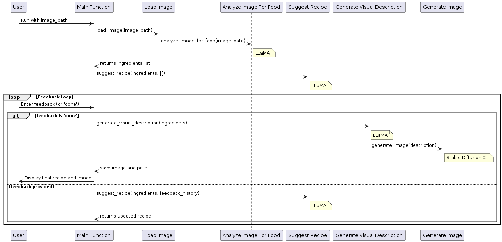
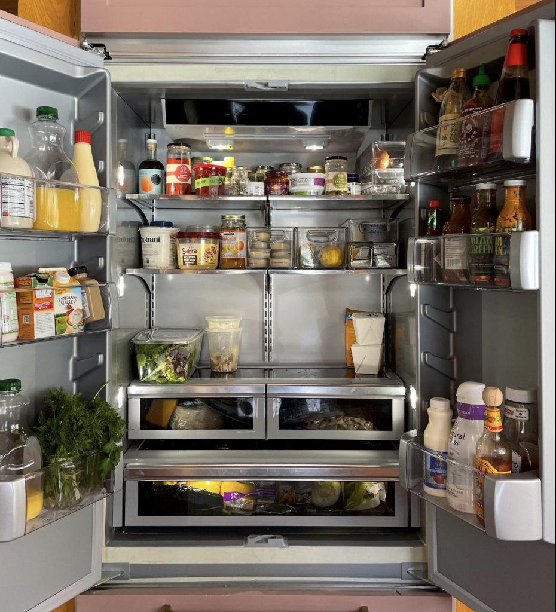

# Echo Recipe

## Overview

This Python tool analyzes food images, suggests recipes based on detected ingredients, adjusts recipes via user
feedback, and generates a visual representation of the final dish.

## Features

- **Image Analysis:** Detects food items in images using the LLaMA AI model.
- **Recipe Suggestion & Adjustment:** Generates and refines recipes based on user input.
- **Image Generation:** Creates an image of the final dish using Stable Diffusion XL.
- **Markdown Output:** Outputs the recipe and image in Markdown format for easy sharing.

## Workflow



1. **Load Image:** Supports both local and URL-based image inputs.
2. **Analyze and List Ingredients:** Uses AI to identify ingredients.
3. **Generate and Adjust Recipes:** Provides initial recipes and iteratively refines them based on user feedback.
4. **Visual and Final Output:** Generates a dish image and compiles the recipe and image into a Markdown file.

## Usage

Run the script from the command line by providing an image file path:



```bash
python main.py sample_kitchen.png
```

## Dependencies

Ensure `torch`, `diffusers`, `ollama`, and other necessary libraries are installed.

## Improvements

- **Switch to Proprietary Models:** Consider replacing the open-source LLaMA and Stable Diffusion XL models with
  proprietary models for improved performance and accuracy.
- **Cloud-Based Inference:** Moving inference to the cloud can enable the application to be used on mobile devices,
  expanding accessibility and reducing local processing requirements.
- **Web Interface:** Develop a web-based user interface to make the tool accessible to a broader audience. This
  interface could facilitate image uploads, display recipe suggestions, and allow users to provide feedback directly
  through a browser.
